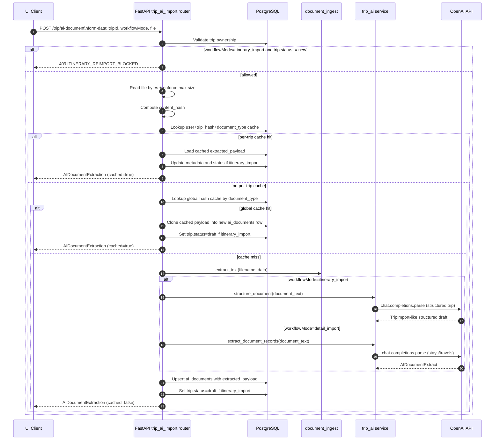
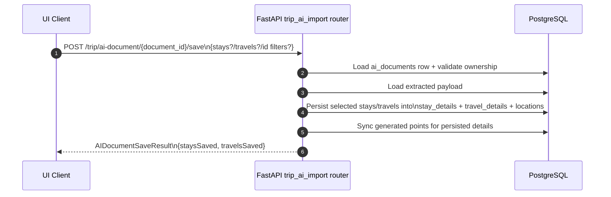

# AI Document Import Flow (Cache Hit vs Cache Miss)

This diagram focuses on AI document import endpoints and branching behavior.

## 1) Sequence: POST /trip/ai-document



## 2) Sequence: POST /trip/ai-document/{document_id}/save



## 3) Endpoint Map for AI Document Path

- POST /trip/ai-document
- GET /trips/{trip_id}/ai-documents
- GET /trip/ai-document/{document_id}
- POST /trip/ai-document/{document_id}/regen
- POST /trip/ai-document/{document_id}/save

Related itinerary flow endpoint:
- POST /trip/ai-import

## 4) Typical Request/Response Shapes

### 4.1 POST /trip/ai-document (multipart form)

```text
tripId=<uuid>
workflowMode=detail_import | itinerary_import
file=<binary upload>
```

### 4.2 AIDocumentExtraction response (example)

```json
{
  "documentId": "533bd626-2e8e-49f2-ba86-90e77f31bb3f",
  "tripId": "5ec22afc-b04a-4f8f-8f80-f4dca11f37fd",
  "filename": "rome-hotel.pdf",
  "documentType": "detail",
  "workflowMode": "detail_import",
  "cached": true,
  "stays": [
    {
      "stayDetailId": "e8d3ac38-2472-4ff6-a8e2-93876c9c1ef6",
      "name": "Hotel Artemide",
      "stayType": "hotel",
      "checkIn": "2026-09-10T15:00:00",
      "checkOut": "2026-09-14T11:00:00",
      "locations": [
        {
          "locationId": "e344607f-8351-44c5-9cb6-ee0806ff3440",
          "role": "venue",
          "name": "Via Nazionale 22, Rome"
        }
      ]
    }
  ],
  "travels": []
}
```

### 4.3 POST /trip/ai-document/{document_id}/save response (example)

```json
{
  "status": "ok",
  "tripId": "5ec22afc-b04a-4f8f-8f80-f4dca11f37fd",
  "documentId": "533bd626-2e8e-49f2-ba86-90e77f31bb3f",
  "staysSaved": 1,
  "travelsSaved": 0
}
```

## 5) Important Behavior Notes

- Itinerary re-import lock is based on trip status: if status != new, itinerary_import is blocked.
- detail_import remains available even when itinerary import is locked.
- Cache keying is content-hash based (SHA-256), not filename based.
- AI extraction itself is non-persistent until saved; persistence occurs in /save.
