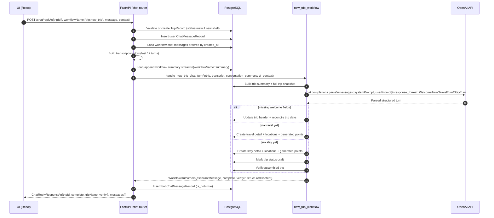
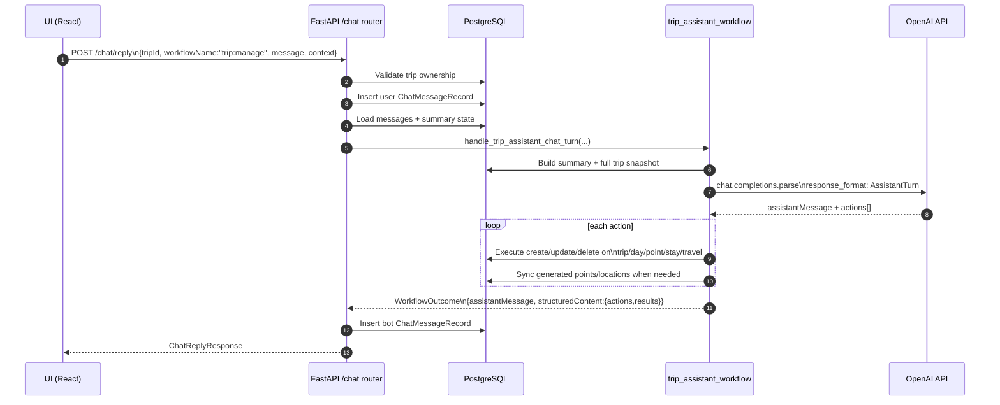
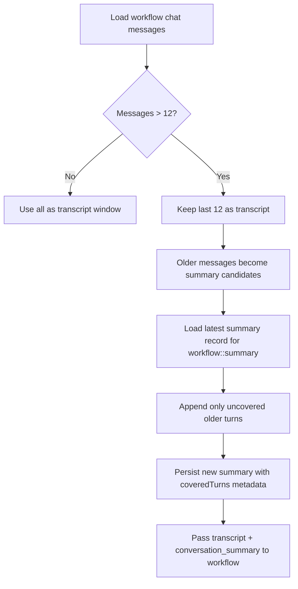

# Chat Endpoint Integration and Data Flow

This document shows how data moves through the chat endpoints, including client payloads, server orchestration, and OpenAI structured calls.

## 1) End-to-End Sequence: trip:new_trip workflow



## 2) End-to-End Sequence: trip:manage workflow (action-oriented)



## 3) Conversation Metadata and Summary Compaction



## 4) Example Payloads

### 4.1 Client -> Server: POST /chat/reply

```json
{
  "tripId": "5ec22afc-b04a-4f8f-8f80-f4dca11f37fd",
  "workflowName": "trip:new_trip",
  "message": "We fly from Chicago to Rome on Sept 10 and stay 4 nights.",
  "context": {
    "page": "trips",
    "chatOverlay": "new_trip",
    "selectedTripId": "5ec22afc-b04a-4f8f-8f80-f4dca11f37fd",
    "workflowName": "trip:new_trip"
  }
}
```

### 4.2 Server -> OpenAI: new_trip staged parse call (conceptual)

```json
{
  "model": "gpt-5.4",
  "messages": [
    {
      "role": "system",
      "content": "<base prompt + stage overlay from api/pripritrip_system_prompt.md>"
    },
    {
      "role": "user",
      "content": "Current trip state + full trip snapshot + rolling summary + transcript + UI context + latest user message"
    }
  ],
  "response_format": "WelcomeTurn | TravelTurn | StayTurn"
}
```

### 4.3 Server -> OpenAI: trip assistant action parse call (conceptual)

```json
{
  "model": "gpt-5.4",
  "messages": [
    {
      "role": "system",
      "content": "<base prompt + stage:assistant_actions overlay>"
    },
    {
      "role": "user",
      "content": "Current trip state + full trip snapshot + rolling summary + transcript + UI context + latest user message"
    }
  ],
  "response_format": "AssistantTurn"
}
```

### 4.4 Server -> Client: ChatReplyResponse (example)

```json
{
  "tripId": "5ec22afc-b04a-4f8f-8f80-f4dca11f37fd",
  "complete": false,
  "tripName": "Italy Honeymoon",
  "verify": null,
  "messages": [
    {
      "messageId": "0f74aa94-fcb2-45e0-b57c-8a2cc6a8772f",
      "tripId": "5ec22afc-b04a-4f8f-8f80-f4dca11f37fd",
      "workflowName": "trip:new_trip",
      "message": "We fly from Chicago to Rome on Sept 10 and stay 4 nights.",
      "structureContent": null,
      "isBot": false,
      "createdAt": "2026-07-08T21:31:47.123456+00:00"
    },
    {
      "messageId": "f4b06d2f-9af1-43de-8e56-66a0f6f58b45",
      "tripId": "5ec22afc-b04a-4f8f-8f80-f4dca11f37fd",
      "workflowName": "trip:new_trip",
      "message": "Great start. What city are you departing from, and what hotel are you staying at in Rome?",
      "structureContent": "{\"tripName\":\"Italy Honeymoon\",\"destinationLocationName\":\"Rome\"}",
      "isBot": true,
      "createdAt": "2026-07-08T21:31:47.456789+00:00"
    }
  ]
}
```

## 5) Endpoints involved in chat integration

- POST /chat/reply
- GET /chat/trips/{trip_id}?workflowName=...
- Internal AI workflow branch when workflowName is trip:new_trip
- Internal AI workflow branch when workflowName starts with trip:
