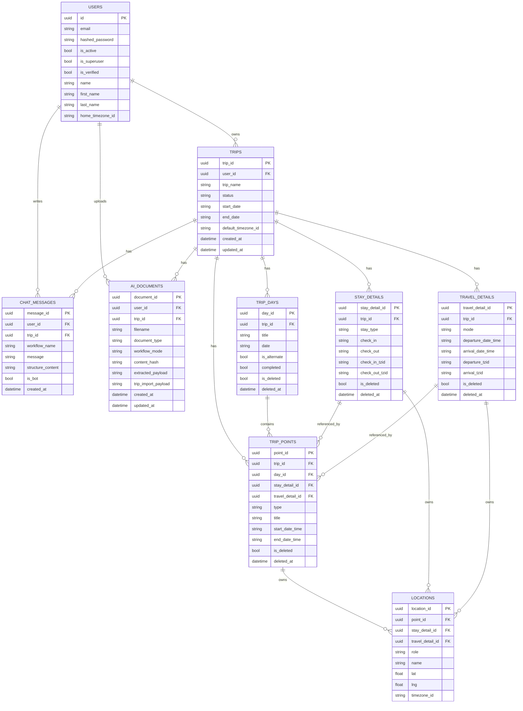

# PriPriTrip Backend Entity Relationship Diagram

This ERD reflects current SQLAlchemy models in api/app/models.py.

## Notes

- Location ownership is polymorphic by nullable foreign keys, with a DB check constraint ensuring exactly one owner is present among point_id, stay_detail_id, travel_detail_id.
- Trip points can optionally reference a stay or travel detail, depending on point type.
- AI documents enforce a uniqueness constraint on user_id + trip_id + content_hash + document_type.
- Chat summaries for long conversations are persisted in chat_messages using workflow names with a ::summary suffix.
